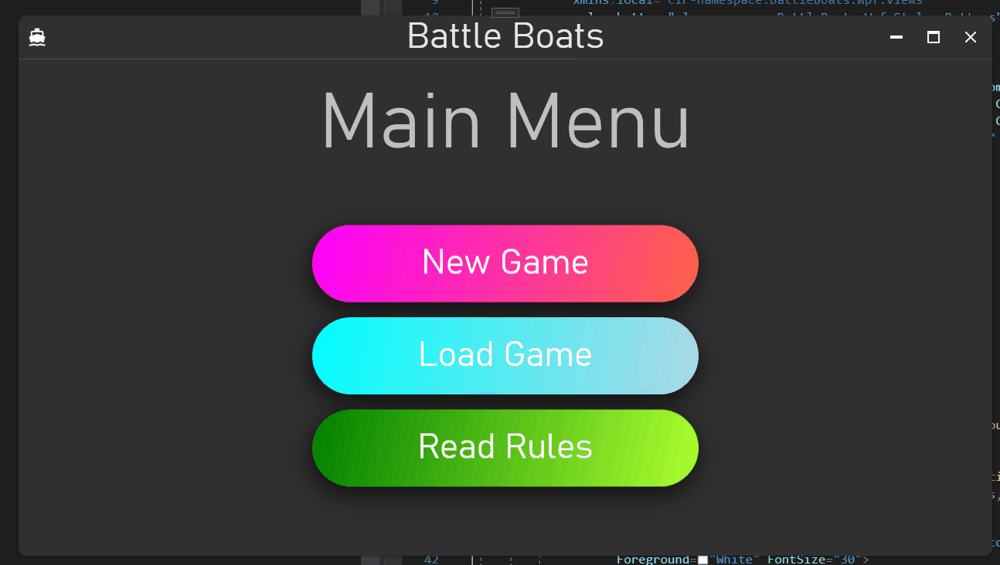

# Battle Boats
Battle ships in WPF!

## Example Gif:



## Success Criteria
#### Programming practices:
1. Loosely couple the UI/design from the business logic
   + Use the MVVM design pattern (Model, View, ViewModel)
   + Makes testing easier
2. Use dependency injection to remove concrete dependencies between classes
3. Use SRP(single responsibility principle) to avoid confusing methods and classes that do more than required
4. Use resources in XAML making it easier to change the design

#### User Experience:
1. Have a intuitive main menu for the user
    + Big buttons, clear font
    + Animations on hover
    + Not too many options or buttons
2. Save game state to file after every move
   + Save as json file
3. Implement the most efficient algorithm for the computer to win:
    http://www.datagenetics.com/blog/december32011/
    https://pageperso.lis-lab.fr/guilherme.fonseca/battleship_conf.pdf
    https://www.csuohio.edu/sites/default/files/82B-2016.pdf
4. Make placing and rotating ships easy and not cumbersome e.g. the easiest would be drag and drop, most cumbersome would be entering the coordinates of the start of the boat
5. If i have time create a settings/config file where the user can define the difficulty, grid size, boat types etc.

## Design
#### MVVM
###### Models
1. Ship
2. Coordinate
3. Game

###### ViewModels
1. MainWindowViewModel
2. MenuViewModel
3. RulesViewModel
4. ShipPlacementViewModel
5. GameBoardViewModel
5. WinnerViewModel

###### Views
1. MenuView
2. RulesView
3. ShipPlacementView
4. GameBoardView
5. WinnerView

#### Services/Utility - Using Dependency Injection
1. IComputerAlgorithmService - Alg the computer uses to take shots
   1. RandomShots
   2. HuntTarget (With, without parity)
   3. ProbabilityDensity
2. ISaveGameService - Save game to file
   1. SaveAsJSON
3. INavigationService - Navigate between Views/ViewModels

## Pseudocode
#### Program overview
```
// Show menu
// Navigate to user choice(e.g. ReadRules)
    // ReadRules:
        // Display rules
    // LoadGame:
        // Load data from json file
        // Pass data to GameBoard
    // NewGame:
        // Get user ShipPlacement
        // Generate computer ShipPlacement
        // Pass ShipPlacement to GameBoard

// GameBoard
    // User plays
        // Picks location to shoot
        // Check if its a hit
        // Notify user of result
        // Save game state
    // Computer plays
        // Use service to get next shot
        // Check if its a hit
        // Notify user and computer of result
        // Save game state
    // Repeat until either user or computer has 0 ship health
    // Display winner
    // Back to Menu
```
#### ShipPlacement
```
// Ship type
    // Ask user ship type
    // Computer iterates through each ship
// Verify ship type is available
// Get ship location
    // Coordinates
    // Rotation
// Verfify ship location
    // Is entirely on grid
    // Does not overlap another ship
// Verify all ships have been placed
// Exit
```
#### Computer Algorithm
###### Random
```
// Generate random coordinate
// Verify coordinate is valid
    // Not shot that coord already
```
###### HuntAndTarget
Random until we hit a ship then we target the four squares
around the hit for our next shot.
```
// Initialize queue for shots:
// Queue random shot

// For game is live:
    // Shoot next shot in queue
        // only if tile is untouched
    // If hit:
        // Add 4 surrounding tiles to queue
    // if miss and queue is empty
        // queue random shot
    // Dequeue shot
```
###### ProbabilityDensity
```
// Calculate Probability of each tile
    // Foreach tile calculate probability
// Pick tile with highest probability
